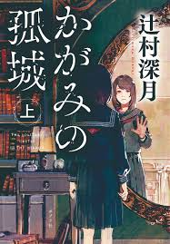
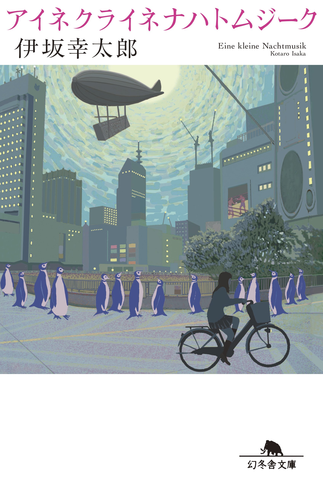

# 読んだ本

## かがみの孤城

辻村深月（つじむらみづき） - ポプラ社

文庫本版を読んだ

上巻 - あらすじ

中1女子のこころは、同級生の真田美織（さなだみおり）から受けたいじめが原因で不登校が続き、引きこもりをしていた。5月のある日、自室の鏡が光り、吸い込まれた先でオオカミさまという狼面をつけた謎の少女が仕切る孤城で、自分と似た問題を抱える中学生リオン、フウカ、スバル、マサムネ、ウレシノ、アキと出会う。この孤城の中に隠された「願いの鍵」を見つけられた1人だけが願いの部屋へ入ることができ、どんな願いでも叶えられると説明する。ただし、孤城にはルールがあり、日本時間の午前9時から午後5時までは鏡を通って現実世界から来て良いが、午後5時以降に孤城に1人でも残っていると、その日に城内にいた者は連帯責任で狼に喰われる。そして、誰かが願いを叶え、この城から出た時点で全員の記憶が消えるという。 by ほぼ Wikipedia

上巻では5月-12月が語られる。概ねみんながゆったり仲良くなっていく筋書きだが、メインどころとしては、みんな同じ中学に進学しようとしていたが不登校であること、リオンは不登校ではないが海外にいて進学できなかったこと、こころが母親にいじめを打ち明けること、子供育成支援教室（フリースクール）にいる喜多嶋先生という寄り添ってくれる先生を軸に繋がりを見せること、おそらく同じ時間軸にいなさそうな伏線が張られたところまでがメインストーリー

個人的には、恋愛至上主義のウレシノに同じような感覚をもった（違う側面も多くあるが）

## アイネクライネナハトムジーク

伊坂幸太郎 - 幻冬舎文庫

ブラックガールズトーク感のある短編集。最後にまとまるのだが時系列がバラバラなあたりパルプフィクション感もある

読み手によってかなり意見が別れそうだが、個人的には一期一会の奇跡や縁の不思議さを感じられる作品だった

ざっくり殴り書き

佐藤は奥さんに逃げられ動揺した藤間さんとサーバ障害をやらかしデータを消したことから街頭アンケートを取っているところからはじまる。最初の描写に日本ボクサーのヘビー級タイトルマッチの中継という伏線が敷かれる。
その後は佐藤周辺が語られる。友人である自由奔放男、織田一真と当時はクラスのマドンナ織田（加藤）由美との仲良しトークが挟まる。
次の章では、美容師美奈子とその客板橋香澄の弟学 - もといヘビー級チャンプのウィンストン小野と電話友達〜付き合うまでの話。その合間に藤間と奥さんがどちらも銀行の記帳をなかなかしない無粋な性格から別れに繋がった話が挟まる
その後、英語教師の深堀先生とその生徒久留米和人と美人織田美緒が自転車の60円シールを剥がす犯人探しをする話。その合間には深堀（旧姓笹塚朱美）と和人の父邦彦が「この娘さんに声をかけられるなんて命知らずだな」とホラ吹いて厄介ごとをかわすシーンが挟まる。結果別れるが、この話の中で再会し、正義感の強い織田美緒が犯人と揉めている時に深堀先生が同じ戦略で切り抜ける一幕がある
その次は化粧品会社の窪田結衣が友人佳織と上司の山田との話がはじまる。最初山田と美奈子の友人関係がしれっと語られる。その後コンペを取りに来た会社の人の中に結衣を昔いじめてた小久保亜季が現れ合コンに誘われる話が続く。結果は中身が変わってないで終わる
最後はウィンストン小野の世界タイトルリベンジマッチを通じて彼に励まされたこの小説の登場人物たちのつながりが一斉に近づく話が起こる。ウィンストンもまたファンの励ましによって試合ではいい戦いを見せる
そして話は幕を閉じる

