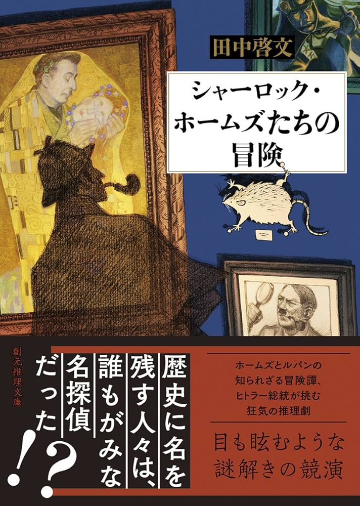

# 読んだ本

## かがみの孤城

辻村 深月（つじむら みづき） - ポプラ社

文庫本版を読んだ

上巻 - あらすじ

中1女子のこころは、同級生の真田美織（さなだみおり）から受けたいじめが原因で不登校が続き、引きこもりをしていた。5月のある日、自室の鏡が光り、吸い込まれた先でオオカミさまという狼面をつけた謎の少女が仕切る孤城で、自分と似た問題を抱える中学生リオン、フウカ、スバル、マサムネ、ウレシノ、アキと出会う。この孤城の中に隠された「願いの鍵」を見つけられた1人だけが願いの部屋へ入ることができ、どんな願いでも叶えられると説明する。ただし、孤城にはルールがあり、日本時間の午前9時から午後5時までは鏡を通って現実世界から来て良いが、午後5時以降に孤城に1人でも残っていると、その日に城内にいた者は連帯責任で狼に喰われる。そして、誰かが願いを叶え、この城から出た時点で全員の記憶が消えるという。 by ほぼ Wikipedia

上巻では5月-12月が語られる。概ねみんながゆったり仲良くなっていく筋書きだが、メインどころとしては、みんな同じ中学に進学しようとしていたが不登校であること、リオンは不登校ではないが海外にいて進学できなかったこと、こころが母親にいじめを打ち明けること、子供育成支援教室（フリースクール）にいる喜多嶋先生という寄り添ってくれる先生を軸に繋がりを見せること、おそらく同じ時間軸にいなさそうな伏線が張られたところまでがメインストーリー

個人的には、恋愛至上主義のウレシノに同じような感覚をもった（違う側面も多くあるが）

下巻 - 最初に一言

まず初めに無理なく綺麗に纏められて意外性もあるいい話だった

あらすじ

下巻は1月から始まる。7人が3学期の初日だけ行こうとするシーンから始まる。こころはそこでも心挫け皆で約束した保健室に向かうが、誰も居ない。2月。結論、マサムネの仮説でパラレルワールドであると推論づけられる。しかし、オオカミサマに否定される。会えないことがわかり、残りの時間を楽しく過ごし、皆は願いの叶う城の鍵は探さず、記憶を残すことを願う。3月末日城の閉まる最終日前日。こころの現実では真田美織によるいじめの際に助けてくれなかった東城萌と邂逅し和解に成功したが、城に行けなかったその日の約束の時間に鏡が割れる。なんでもアキが約束の時間を超え、連帯責任でこころ以外がオオカミに襲われる。事態を解決するため城に向かおうとする矢先、読書好きの東城萌の家にあった本を思い返して、あの城の話が「赤ずきん」ではなく「7人の子山羊」であることに気づく。城に戻り、6人の記憶に触れる中で、パラレルワールドでなく時代が違うのだと気づく。そして、城の鍵を見つけ無事アキと皆を救い出す願いを叶える。7人が7年違いの不登校生徒だと知る。最後皆それぞれ誓ったり願ったりして城を後にし、記憶をなくす。現実世界に戻ったこころは新学期から学校へ臨む。

ネタバレ。大事な要素

スバルは1985年
アキは1992年
オオカミサマ(リオンの姉ミオ)1999年
こころとリオンが2006年
マサムネが2013年
フウカが2020年
ウレシノが2027年

こころは同級生のいじめっこの真田美織の彼氏がこころに気をもったことで逆恨みされていじめられた子。
マサムネはホラマサ。博識だが、嘘をついたことでハブられるゲーム好き。
ウレシノは恋愛煩悩。ゆえにいじめられた子。
スバルはおじいちゃんにお小言。不良の兄に囲まれ、誰にも愛されない少年。
フウカは幼少期からピアノ漬けで成果出せず絶望した少女。
アキは大事な伯母を亡くし彼氏が蒸発し、再婚後の父にレイプされそうになる子。後のこころの教室の喜多嶋晶子。
リオンは6歳の時に大好きだった13歳の姉を亡くし、単身ハワイで通学している少年。その姉がオオカミサマであり、病気で亡くなった姉が実は単身で心細かったリオンのために、城を創造し、本来行くはずだったけど行けなくなった雪科第五中の7年ずつ年差の子達を集めて世界を作った。
最後、夢のなかったスバルはマサムネが「友達がゲームを作った」話が嘘にならないようにゲーム制作者になる約束をし、ピアノ以外生き方がわからなかったフウカに改めて告白したウレシノが告白を受け止め支えになり、全員の記憶を見たこころがアキに生きてと伝え、そのアキが喜多嶋先生となり助け、最後オオカミサマを見破ったリオンは中2で再登校に臨むこころの前に現れる。(おそらく母に帰りたいと伝えて再度雪科第五中に通わせてほしいと伝えた)

所感

自分の予想は時代違いは合っていた。それはこころがウレシノに「喜多嶋先生きれいな人だよね」に対して「綺麗？」と言ったところから、お祖母さんなのかな？じゃあ、時代違いかな？となったから。こういった推理要素があるのは楽しかった。その他の情報からは拾えなかったが。7人の子山羊は見破れなかった。また、この時点では非公開情報のアキが喜多嶋先生であることやリオンの姉がオオカミサマであることは驚き要素としてよかったし、途中からそうかな？と思わせる描写が出てきて、若干の推理の余白があるのも良かった。最後も無理に全員登場させず、こころとアキとリオンの関係性にだけ触れるのも、シナリオとして綺麗にまとめ上げすぎずよかった。あと、リオンの姉が病気で雪科第五中に通えず亡くなった姉であることを、皆が記憶をなくし去った後、1人残り、オオカミサマに言及する姿はもう1人の主人公だった。なんとなく終わり方と関係性がCLAMPのCCさくらのさくらと小狼みたいだったのは個人的には好きな作品と重なって良かった。ただ、アキが約束の時間を破って皆を巻き込んで死のうとする一幕の背景に見え隠れしていた「問題児」の憎まれ口から出た「ーーじゃあ、私が他の世界に逃げ込んだりするのは無理なわけね。」「ーー別に願いってさ、叶えちゃってもいいんだよね。どうせ、外の世界で会えないなら、三月が終わってからも、私たちに残るのって所詮記憶だけなんだよ？むなしくない？」「ーー親がいろいろ考えてくれてる家はすごいよね。うちらの親とは違うね、こころ」という言葉の端々から自殺志願を見抜けなかったのは悔しい

## アイネクライネナハトムジーク

伊坂 幸太郎（いさか こうたろう） - 幻冬舎文庫

ブラックガールズトーク感のある短編集。最後にまとまるのだが時系列がバラバラなあたりパルプフィクション感もある

読み手によってかなり意見が別れそうだが、個人的には一期一会の奇跡や縁の不思議さを感じられる作品だった

ざっくり殴り書き

佐藤は奥さんに逃げられ動揺した藤間さんとサーバ障害をやらかしデータを消したことから街頭アンケートを取っているところからはじまる。最初の描写に日本ボクサーのヘビー級タイトルマッチの中継という伏線が敷かれる。

その後は佐藤周辺が語られる。友人である自由奔放男、織田一真と当時はクラスのマドンナ織田（加藤）由美との仲良しトークが挟まる。

次の章では、美容師美奈子とその客板橋香澄の弟学 - もといヘビー級チャンプのウィンストン小野と電話友達〜付き合うまでの話。その合間に藤間と奥さんがどちらも銀行の記帳をなかなかしない無粋な性格から別れに繋がった話が挟まる

その後、英語教師の深堀先生とその生徒久留米和人と美人織田美緒が自転車の60円シールを剥がす犯人探しをする話。その合間には深堀（旧姓笹塚朱美）と和人の父邦彦が「この娘さんに声をかけられるなんて命知らずだな」とホラ吹いて厄介ごとをかわすシーンが挟まる。結果別れるが、この話の中で再会し、正義感の強い織田美緒が犯人と揉めている時に深堀先生が同じ戦略で切り抜ける一幕がある

その次は化粧品会社の窪田結衣が友人佳織と上司の山田との話がはじまる。最初山田と美奈子の友人関係がしれっと語られる。その後コンペを取りに来た会社の人の中に結衣を昔いじめてた小久保亜季が現れ合コンに誘われる話が続く。結果は中身が変わってないで終わる

最後はウィンストン小野の世界タイトルリベンジマッチを通じて彼に励まされたこの小説の登場人物たちのつながりが一斉に近づく話が起こる。ウィンストンもまたファンの励ましによって試合ではいい戦いを見せる

そして話は幕を閉じる

## シャーロック・ホームズたちの冒険

田中啓文（たなか　ひろふみ） - 創元推理文庫

推理小説の短編集。最初シャーロック・ホームズ「スマトラの大ねずみ」の話が来る。内容としては、顔だけが残る殺人事件が3件立て続けに起こる。結論は被害者は全員生きている保険金詐欺事件。事件現場に残る顔は実は顔を真似る虫がいてその虫だったというもの。そして、この事件を裏で糸を引いていたのは死んだはずのモリアーティというオチ。しかも、モリアーティは魔術で復活したという話で、ホームズも陰陽師の術で復活したというオチだった。主人公がワトスンで、ホームズが生前麻薬をやっていた影響か、ワトスンの妄想だったか、本当の話だったかがわからないが、本当の記録だと確信しているという筆者の意見で締めくくっている。

正直シャーロック・ホームズの推理集を期待していたので、ファンタジーな話と想定していなくて読むのに苦労した。その上、2話目はシャーロック・ホームズの話ですらなく、「忠臣蔵の密室」という話だったが、日本の故事のような話で、登場人物が長い漢字の氏名が出てきて、期待外に加えて読みづらい話がきてしまったので読みきれず離脱してしまった。推理小説の短編集として期待するならこの本はオススメしづらい。
